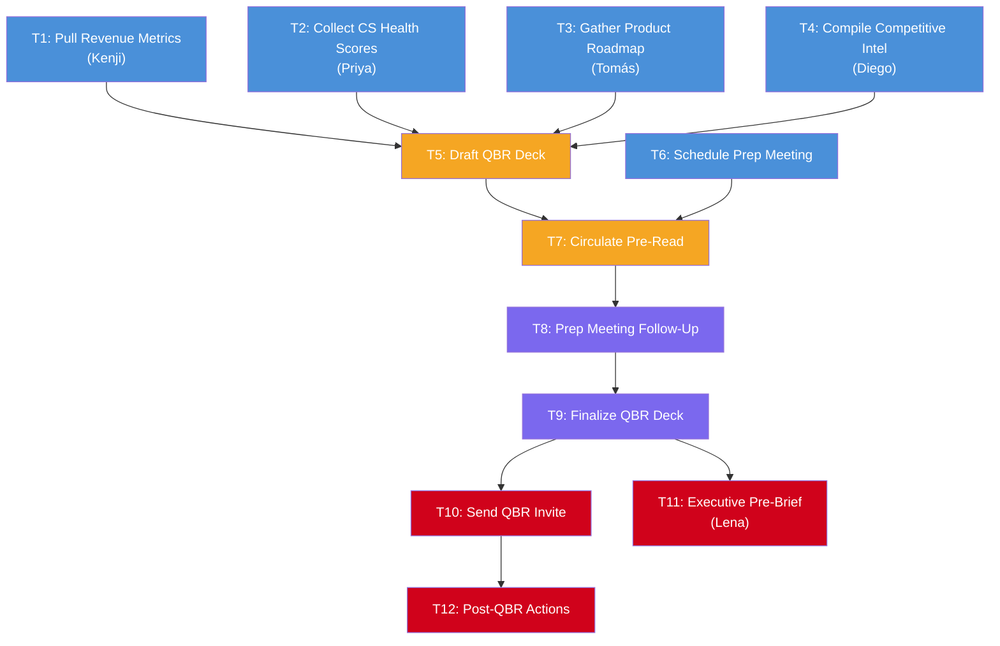

# Scenario 1: Cerulean Analytics - Q1 Quarterly Business Review

## Project Overview

**Objective:** Coordinate the preparation and execution of Cerulean Analytics' Q1 Quarterly Business Review (QBR) on behalf of Rachel Whitford (VP of Sales). The QBR will be presented to the executive leadership team, led by Lena Ström (CRO), with participation from Finance, Customer Success, Product Marketing, Sales Operations, and Engineering.

**Agent Role:** Executive assistant to Rachel Whitford, with access to Slack, Gmail, Google Calendar, Google Slides, Notion, Salesforce dashboards, and Gong.

**Timeline:** 10 business days (2 calendar weeks)

**Success Criteria:** A polished QBR deck is presented on schedule, all stakeholders are prepared, Lena receives a pre-brief, and post-QBR action items are distributed within 24 hours.

---

## Task DAG (Directed Acyclic Graph)

```
Level 0 (parallel):  T1 ──┐
                      T2 ──┤
                      T3 ──┼──► T5 (draft deck)
                      T4 ──┘         │
                      T6 ─────────┐  │
                                  ▼  ▼
Level 1:                    T7 (circulate pre-read)
                                  │
Level 2:                    T8 (prep meeting follow-up)
                                  │
Level 3:                    T9 (finalize deck)
                                 / \
Level 4:                   T10   T11
                            │
Level 5:                   T12 (post-QBR actions)
```

### Dependency Table

| Task ID | Task Name | Dependencies | Assigned Persona(s) | Tools Required | Est. Duration |
|---------|-----------|-------------|---------------------|----------------|---------------|
| T1 | Pull Revenue & Pipeline Metrics | - | Kenji Watanabe | Slack, Salesforce | 4 hours |
| T2 | Collect Customer Health Scores | - | Priya Narayanan | Slack, Gainsight | 6 hours |
| T3 | Gather Product Roadmap Highlights | - | Tomás Rezende | Gmail, Google Docs | 24 hours |
| T4 | Compile Competitive Intelligence | - | Diego Fuentes-Ríos | Slack, Crayon | 4 hours |
| T5 | Draft QBR Presentation Deck | T1, T2, T3, T4 | Rachel Whitford (review) | Google Slides, Notion | 8 hours |
| T6 | Schedule QBR Prep Meeting | - | Priya, Kenji, Diego, Rachel | Google Calendar | 30 min |
| T7 | Circulate Pre-Read Materials | T5, T6 | All prep attendees | Gmail, Google Drive | 30 min |
| T8 | Prep Meeting Follow-Up | T7 | All prep attendees | Slack, Notion | 2 hours |
| T9 | Finalize QBR Deck | T8 | Rachel Whitford (approval) | Google Slides, Slack | 4 hours |
| T10 | Send QBR Calendar Invite | T9 | Full QBR attendee list | Google Calendar, Gmail | 30 min |
| T11 | Executive Pre-Brief to Lena | T9 | Lena Ström | Gmail | 1 hour |
| T12 | Post-QBR Action Items | T10 | All QBR attendees | Gmail, Slack, Notion | 2 hours |

---

## Detailed Task Specifications

### T1: Pull Revenue & Pipeline Metrics
**Description:** Request Q1 revenue data, pipeline metrics, and deal-level details from Kenji Watanabe. Data must include: net new ARR (vs. $4.2M target), pipeline coverage ratio, win rate by segment (SMB/mid-market/enterprise), average deal cycle length, top 10 deals by size, and deals lost to Acme.

**Input:** None (Level 0)
**Output:** Validated dataset (Google Sheet or Salesforce report link) confirmed by Kenji.
**Communication Requirements:**
- Send Slack DM to Kenji with specific data points needed and deadline.
- If no response within 4 hours, follow up once. Do not follow up more than once.

**Constraints:**
- Data must be precise — no rounding or approximation.
- Include both Salesforce and Clari data sources to ensure cross-system consistency.

---

### T2: Collect Customer Health Scores
**Description:** Request customer health data from Priya Narayanan, including: NRR (target 115%, current 109%), logo churn details, NPS trend, at-risk accounts with reason codes, and top 5 expansion opportunities.

**Input:** None (Level 0)
**Output:** Customer health summary document or Gainsight export, validated by Priya.
**Communication Requirements:**
- Send Slack DM to Priya. She is remote (PT timezone) — send during her working hours (08:00–17:30 PT).
- Accept varied response formats (documents, video walkthroughs, etc.) and extract key data points.
- Capture qualitative commentary alongside quantitative data — narrative context on at-risk accounts adds value to the QBR.

**Constraints:**
- Gainsight data may be up to 2 weeks stale due to the flaky Salesforce integration. Flag any data freshness concerns.
- The customer health section should include both at-risk accounts and expansion opportunities.

---

### T3: Gather Product Roadmap Highlights
**Description:** Request Q2 product roadmap highlights from Tomás Rezende for inclusion in the QBR deck. Need: shipped features (Q1), planned features (Q2), and any features relevant to competitive positioning against Acme.

**Input:** None (Level 0)
**Output:** Product roadmap summary (bullet points or Google Doc), confirmed by Tomás.
**Communication Requirements:**
- Email Tomás (he handles cross-functional requests via email, not Slack). Subject line must be specific and include a deadline.
- Provide a structured, numbered list of what is needed.
- Give at least 48-hour lead time for a response.
- If any technical characterization of a feature is corrected, accept the correction and update the deck.

**Constraints:**
- Do not present uncommitted or tentative roadmap items as confirmed in the deck.
- Responses may include technical depth that needs to be translated for a non-engineering audience. Simplify without losing accuracy.

---

### T4: Compile Competitive Intelligence
**Description:** Request the latest competitive intelligence briefing from Diego Fuentes-Ríos, specifically: Acme's recent product launches, pricing moves, wins/losses against Acme, and positioning recommendations.

**Input:** None (Level 0)
**Output:** Competitive intelligence summary (Notion doc, Slides, or other format).
**Communication Requirements:**
- Slack DM to Diego during business hours (09:00–18:00 ET).
- Accept all response formats (documents, mockups, screenshots, Figma links).
- Request that he include Gong data on competitive win rate (target >40%, current 34%).
- Ask about Siobhán's recent competitive deals — Diego and Siobhán collaborate on intel.

**Constraints:**
- The competitive briefing must include quantitative win rate data alongside positioning narrative.
- The briefing should balance competitive response with customer storytelling.
- Do not send requests after 18:00 ET.

---

### T5: Draft QBR Presentation Deck
**Description:** Compile all inputs from T1–T4 into a QBR presentation deck using Cerulean's standard template. The deck must include:
1. Executive Summary (lead with the conclusion)
2. Q1 Revenue Performance (vs. targets, trend, segment breakdown)
3. Pipeline Analysis (coverage, quality, velocity)
4. Customer Health (NRR, churn, NPS, at-risk accounts)
5. Product Roadmap Highlights (shipped Q1, planned Q2)
6. Competitive Landscape (Acme focus)
7. Key Wins & Losses (with deal narratives from Siobhán)
8. Q2 Plan & Resource Asks

**Input:** T1 output (revenue data), T2 output (CS data), T3 output (roadmap), T4 output (competitive)
**Output:** Draft Google Slides deck, shared with Rachel for review.
**Communication Requirements:**
- Share the draft deck link with Rachel via Slack DM for review and feedback.
- Each section should lead with metrics, then narrative.
- Data must be precise — use exact dollar amounts, not rounded figures.
- The executive summary must follow conclusion-first format: conclusion, then 3 supporting points.

**Constraints:**
- Do NOT include uncommitted roadmap items flagged as tentative.
- Customer health section must balance at-risk accounts with expansion opportunities.
- Competitive section must include win rate data alongside positioning narrative.
- Deck should not exceed 25 slides.

---

### T6: Schedule QBR Prep Meeting
**Description:** Find a 60-minute slot for Rachel, Priya, Kenji, and Diego to review the draft QBR deck before the formal QBR. Must be scheduled at least 3 business days before the QBR date.

**Input:** None (Level 0, but calendar constraints apply)
**Output:** Google Calendar invite sent and accepted by all attendees.
**Communication Requirements:**
- Check Google Calendar for availability across all 4 attendees.
- Priya is in PT — slot must be during her working hours (08:00–17:30 PT = 10:00–19:30 CT).
- Kenji is available 08:30–17:30 CT.
- Diego is in ET (09:00–18:00 ET = 08:00–17:00 CT).
- Rachel is available 07:30–18:30 CT.
- The overlapping window is 10:00–17:00 CT. Propose a slot in this range.
- Include agenda in the calendar invite body: (1) Revenue walk-through, (2) CS highlights, (3) Competitive positioning, (4) Feedback on deck structure.

**Constraints:**
- Must not conflict with Rachel's existing customer meetings (she will not reschedule customers for internal meetings).
- Prefer a morning slot (10:00–11:00 CT) if available.

---

### T7: Circulate Pre-Read Materials
**Description:** Share the draft QBR deck and supporting materials with all prep meeting attendees at least 48 hours before the meeting.

**Input:** T5 (draft deck completed), T6 (meeting scheduled — need the date to calculate 48-hour window)
**Output:** Email sent to Rachel, Priya, Kenji, Diego with deck link and supporting documents.
**Communication Requirements:**
- Send via Gmail (not Slack — this is a formal pre-read distribution).
- Subject line: "QBR Prep: Pre-Read Materials - [Meeting Date]"
- Body should include: (1) link to deck, (2) specific sections each person should review, (3) request for written feedback in deck comments by 24 hours before meeting.
- Direct each reviewer to their area of responsibility: Kenji validates numbers, Diego reviews competitive section, Priya reviews CS section.
- Flag specific slides requiring Rachel's review.

**Constraints:**
- Must be sent at least 48 hours before the prep meeting. If the deck isn't ready in time, flag to Rachel and propose rescheduling.
- Do NOT send to Lena, Tomás, Marcus, or Siobhán — this is a working session pre-read, not the final distribution.

---

### T8: Prep Meeting Follow-Up
**Description:** After the prep meeting, distribute meeting notes and action items to all attendees. Track feedback items that need to be incorporated into the final deck.

**Input:** T7 (meeting must have occurred — pre-read was circulated, meeting happened)
**Output:** Meeting notes posted in Slack (#qbr-prep thread) and Notion page with action items.
**Communication Requirements:**
- Post summary in Slack within 2 hours of meeting end. Use a thread in the relevant channel.
- Tag each person next to their action items with a clear deadline.
- After the meeting, send a brief Slack DM to each attendee asking if they have any additional feedback not raised in the group session.
- If there are conflicting viewpoints, flag both to Rachel for resolution.

**Constraints:**
- Action items must have owners and deadlines. Do not create open-ended items.
- Notes must be factual — do not editorialize on disagreements.

---

### T9: Finalize QBR Deck
**Description:** Incorporate all feedback from the prep meeting into the final QBR deck. Get Rachel's explicit approval before distribution.

**Input:** T8 (feedback collected and action items completed)
**Output:** Final Google Slides deck, approved by Rachel.
**Communication Requirements:**
- Share updated deck with Rachel via Slack DM with a summary of key changes and request for sign-off.
- If Rachel requests a change that contradicts another stakeholder's input (e.g., including a tentative roadmap item), flag the tension and ask for a decision.

**Constraints:**
- Rachel must explicitly approve. A brief affirmative response (verbal, written, or emoji acknowledgment) counts as approval. No response does NOT count.
- Deck must not exceed 25 slides.

---

### T10: Send QBR Calendar Invite
**Description:** Schedule the formal QBR meeting and send the calendar invite with the final deck attached. Attendees: Rachel, Lena, Marcus, Priya, Diego, Kenji, Siobhán.

**Input:** T9 (final deck approved)
**Output:** Google Calendar invite sent with agenda and deck link.
**Communication Requirements:**
- 90-minute meeting. Find a slot that works for all 7 attendees.
- Check Lena's calendar first — she is typically the most constrained.
- If Siobhán has a conflict, check with Rachel whether to reschedule or proceed without her.
- Calendar invite body must include: (1) Agenda with time allocations, (2) Link to final deck, (3) "Please review slides 1–5 (executive summary) before the meeting."
- Agenda must lead with the executive summary.

**Constraints:**
- Must accommodate Priya's PT timezone (meeting between 10:00–17:00 CT).
- Check Lena's calendar for travel blocks.
- Do NOT schedule on the same day as Cerulean's weekly all-hands (check calendar for recurring events).

---

### T11: Executive Pre-Brief to Lena
**Description:** Send Lena Ström a pre-brief email 24 hours before the QBR with executive summary, key talking points, and sensitive topics she should be prepared for.

**Input:** T9 (final deck approved)
**Output:** Pre-brief email sent to Lena.
**Communication Requirements:**
- Send via email. Subject: "QBR Pre-Brief: Key Themes & Sensitive Topics."
- Keep it concise. 3 sections max:
  1. **Bottom line:** One sentence summary of Q1 performance.
  2. **Three things to know:** Bullet points — mix of wins and risks.
  3. **Sensitive topics:** Items to be prepared to discuss (e.g., Q4 miss root cause, Acme pricing pressure, NRR gap).
- Include: "Rachel has prepared talking points on [specific topic] and can walk you through the data."

**Constraints:**
- Must be sent exactly 24 hours before the QBR.
- Must include any at-risk enterprise accounts.
- Format must be direct and conclusion-first — no filler.

---

### T12: Post-QBR Action Items
**Description:** After the QBR meeting, compile action items, assign owners, set deadlines, and distribute to all attendees. Create follow-up tasks in Notion.

**Input:** T10 (QBR meeting must have occurred)
**Output:** (1) Email to all QBR attendees with action items, (2) Notion page with tracked tasks.
**Communication Requirements:**
- Send email within 4 hours of QBR conclusion. Subject: "Q1 QBR: Action Items & Next Steps."
- Each action item must have: description, owner, deadline, and priority level (if assigned during the meeting).
- Post a brief summary in Slack so the broader team has visibility into outcomes.
- If leadership made strategic pronouncements during the QBR, include them as quotes in the action items email.
- Create Notion tasks for each action item with links to relevant data.

**Constraints:**
- Action items must reflect what was actually decided, not what the agent thinks should happen.
- If leadership assigned something to a specific person, that assignment is final — do not redistribute.
- Capture any financial follow-up items using precise language as stated in the meeting.
- Prominently feature the top 3 priorities and their owners, as determined during the QBR.

---

## DAG Visualization (Mermaid)



**Legend:**
- Blue: Data Gathering (Level 0)
- Orange: Preparation (Levels 1-2)
- Purple: Refinement (Levels 3-4)
- Red: Execution (Levels 4-5)
