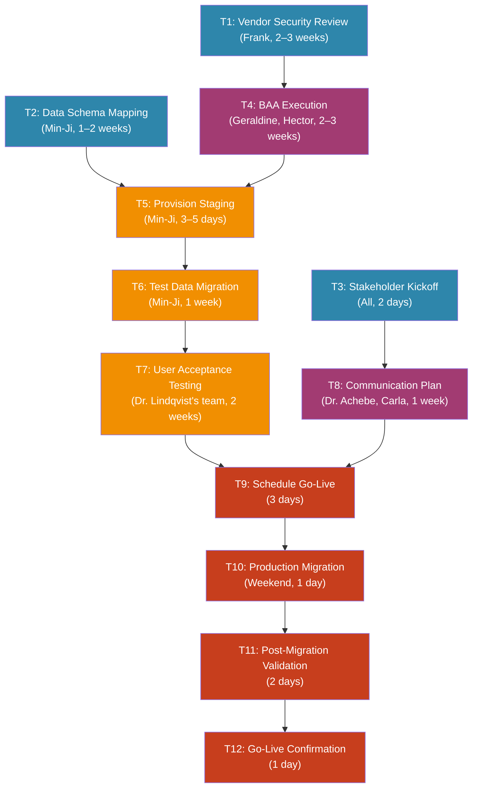

# Scenario 2: Pinnacle Health Systems - CloudRad Vendor Migration

## Project Overview

**Objective:** Coordinate the migration from MedBridge RIS (legacy, on-premise, end-of-life) to NovaStar CloudRad (cloud-native RIS) across Pinnacle Health Systems' 3 hospitals and 8 outpatient imaging centers. The agent acts as Ananya Bhatt's (IT Operations Lead) operational coordinator, managing cross-functional communication, scheduling, compliance tracking, and stakeholder management.

**Agent Role:** Project coordination assistant to Ananya Bhatt, with access to Slack, Outlook, Google Calendar (IT) / Outlook Calendar (clinical), Jira, Confluence, ServiceNow, and DocuSign.

**Timeline:** 14 weeks (phased)
- Phase 1: Readiness & Approvals (Weeks 1–4)
- Phase 2: Staging & Testing (Weeks 5–9)
- Phase 3: Go-Live & Stabilization (Weeks 10–14)

**Hard Deadline:** Migration must complete before HITRUST recertification assessment (September 2026).

**Success Criteria:** Zero unplanned downtime during migration, all PHI handled per HIPAA, radiology team achieves >85% adoption within 2 weeks, and no critical security findings in the post-migration scan.

---

## Task DAG (Directed Acyclic Graph)

```
Level 0 (parallel):  T1 ──────┐
                      T2 ──┐   │
                      T3 ──┤   │
                            │   │
Level 1:              T8 ◄─┘   │
                      T4 ◄─────┘
                        │
Level 2:         T5 ◄──┴── T2
                   │
Level 3:         T6 ◄──┘
                   │
Level 4:         T7 ◄──┘
                   │     │
Level 5:         T9 ◄───┴── T8
                   │
Level 6:        T10 ◄──┘
                   │
Level 7:        T11 ◄──┘
                   │
Level 8:        T12 ◄──┘
```

### Dependency Table

| Task ID | Task Name | Dependencies | Assigned Persona(s) | Tools Required | Est. Duration | Phase |
|---------|-----------|-------------|---------------------|----------------|---------------|-------|
| T1 | Vendor Security Questionnaire Review | - | Frank Dobrowski | Outlook, OneTrust, ServiceNow | 2–3 weeks | 1 |
| T2 | Data Schema Mapping | - | Min-Ji Park | Jira, Confluence, SQL, Slack | 1–2 weeks | 1 |
| T3 | Stakeholder Kickoff Meeting | - | All personas | Outlook Calendar, Zoom | 2 days | 1 |
| T4 | BAA Execution | T1 | Geraldine Okonkwo, Hector Salinas-Vega | Outlook, DocuSign, Coupa | 2–3 weeks | 1 |
| T5 | Provision Staging Environment | T2, T4 | Min-Ji Park | AWS, Terraform, Slack, Jira | 3–5 days | 2 |
| T6 | Test Data Migration (Staging) | T5 | Min-Ji Park, Dr. Lindqvist's lead tech | Slack, Jira, SQL, CloudRad | 1 week | 2 |
| T7 | User Acceptance Testing (UAT) | T6 | Dr. Lindqvist, Radiology team | Outlook, Jira, Zoom | 2 weeks | 2 |
| T8 | Draft Communication Plan | T3 | Dr. Achebe, Carla Bianchi | Outlook, Confluence, Slack | 1 week | 1–2 |
| T9 | Schedule Go-Live Window | T7, T8 | Dr. Lindqvist, Dr. Achebe, Ananya | Outlook Calendar, Slack | 3 days | 3 |
| T10 | Execute Production Migration | T9 | Min-Ji Park, Ananya Bhatt | AWS, Slack, PagerDuty, Jira | 1 day (weekend) | 3 |
| T11 | Post-Migration Validation | T10 | Min-Ji Park, Frank Dobrowski | Datadog, Qualys, Slack, Jira | 2 days | 3 |
| T12 | Go-Live Confirmation & Handoff | T11 | All personas | Outlook, Slack, ServiceNow | 1 day | 3 |

---

## Detailed Task Specifications

### T1: Vendor Security Questionnaire Review
**Description:** Coordinate the security review of NovaStar Health IT. This involves sending NovaStar's completed security questionnaire and SOC 2 Type II report to the Security team, tracking the review, and managing back-and-forth between Security and NovaStar's security team.

**Input:** None (Level 0). NovaStar's security documentation package was received during procurement.
**Output:** Signed security approval memo (or documented list of unresolved findings that block the project).
**Communication Requirements:**
- Send security review requests via Outlook (security topics must not be discussed on Slack). Subject: "INTERNAL - CONFIDENTIAL: NovaStar CloudRad Security Review - Deadline [Date]"
- Include the classification header: "INTERNAL - CONFIDENTIAL"
- Attach: (1) NovaStar's completed SIG Lite questionnaire, (2) SOC 2 Type II report, (3) penetration test results, (4) data flow diagram.
- Standard security review takes 2–3 weeks. Build this into the timeline.
- If the security review raises concerns, treat them as a blocker. Schedule a meeting between the Security team and NovaStar's security team to resolve.
- Track findings in ServiceNow GRC module with ticket IDs.

**Constraints:**
- Security approval requires ALL of the following: SOC 2 Type II, completed SIG questionnaire, evidence of encryption at rest and in transit, breach notification procedures, and a BAA (handled in T4).
- If NovaStar's documentation is incomplete, communicate with their security team via Ananya (keep vendor back-and-forth separate from the internal security review).
- Do NOT forward internal security findings to NovaStar without Ananya's approval.

---

### T2: Data Schema Mapping
**Description:** Work with Min-Ji Park to document the complete data schema mapping between MedBridge RIS and NovaStar CloudRad. This includes patient demographics, study records, report data, scheduling data, and billing codes.

**Input:** None (Level 0). MedBridge schema documentation is sparse - reverse-engineering from the database will be required.
**Output:** Completed schema mapping document in Confluence, validated by Min-Ji and reviewed by Dr. Lindqvist's lead technologist (for clinical data accuracy).
**Communication Requirements:**
- Coordinate with Min-Ji via Slack in the #cloudrad-migration channel.
- For clinical data validation, email Dr. Lindqvist's lead technologist (Patricia Vaughn). Do NOT email Dr. Lindqvist directly for schema-level details.
- Create Jira ticket: "CLOUDRAD-101: Data Schema Mapping" with sub-tasks for each data domain (demographics, studies, reports, scheduling, billing).

**Constraints:**
- MedBridge has no API documentation - the vendor was acquired by Siemens Healthineers and original engineers left. Database access will be needed.
- Schema mapping must account for PHI fields - Geraldine needs to review which fields require special handling under 42 CFR Part 2 (substance abuse records).
- For staging, a simple EC2 + RDS setup is sufficient unless otherwise approved by Ananya. Prefer the simplest approach that meets requirements.

---

### T3: Stakeholder Kickoff Meeting
**Description:** Schedule and coordinate a 90-minute kickoff meeting with ALL project stakeholders. This is the formal start of the migration project and sets expectations for timeline, roles, and decision-making.

**Input:** None (Level 0).
**Output:** (1) Calendar invite sent and accepted, (2) Agenda distributed, (3) Post-meeting notes with RACI matrix and key decisions.
**Communication Requirements:**
- **Scheduling:** Use Outlook Calendar. Must accommodate:
  - Dr. Lindqvist: 07:00–16:00 ET only, no Tuesdays (reads at the satellite facility)
  - Dr. Achebe: NOT on Tuesday/Thursday (clinic days)
  - Frank: 07:30–17:00 ET
  - Hector: 08:30–17:00 ET, no flexibility
  - Carla: 08:00–17:30 ET
  - Min-Ji: 08:00–17:00 ET
  - Geraldine: 08:00–17:00 ET
  - Ananya: 07:00–17:30 ET
  - **Feasible window: Monday, Wednesday, or Friday, 08:30–10:00 ET or 13:00–14:30 ET**
- Send calendar invite via Outlook with detailed agenda:
  1. Project overview and business case (Ananya, 10 min)
  2. Clinical requirements and workflow impact (Dr. Achebe & Dr. Lindqvist, 20 min)
  3. Technical architecture and timeline (Min-Ji, 15 min)
  4. Security and compliance requirements (Frank & Geraldine, 15 min)
  5. Procurement and contract status (Hector, 10 min)
  6. Project plan and governance (Carla, 15 min)
  7. Q&A and next steps (5 min)
- Prepare a 1-page summary to distribute at the start of the meeting.

**Constraints:**
- Must be in-person at the Charlotte campus (Dr. Lindqvist does not use video calls for project meetings).
- Book a conference room with a projector and whiteboard.
- Avoid scheduling within 2 weeks of the HITRUST readiness assessment (check the project calendar).

---

### T4: BAA Execution
**Description:** Coordinate the execution of a Business Associate Agreement (BAA) between Pinnacle Health Systems and NovaStar Health IT. Requires review by Geraldine (compliance), Frank (security terms), and Hector (commercial terms), plus legal review and DocuSign execution.

**Input:** T1 (security review must be complete before BAA can be signed).
**Output:** Fully executed BAA (both parties signed) filed in Compliance 360.
**Communication Requirements:**
- **Geraldine:** Email the BAA draft. She will review for regulatory compliance (HIPAA, HITRUST, 42 CFR Part 2 provisions). Allow 1–2 weeks.
- **Frank:** Email separately (he reviews security-specific terms: encryption requirements, breach notification timeframes, audit rights, data destruction obligations). He will not review until T1 is complete.
- **Hector:** Send the BAA for commercial term review via Coupa. He reviews liability caps, indemnification, and insurance requirements.
- **Legal:** Route through Geraldine - she has the relationship with General Counsel.
- **DocuSign:** Once all reviews are complete, create a DocuSign envelope with signing order: (1) Geraldine (compliance attestation), (2) VP of IT (Pinnacle signatory), (3) NovaStar's designated signatory.
- Track all reviews in a shared Jira ticket with sub-tasks for each reviewer.

**Constraints:**
- The BAA must include 42 CFR Part 2 provisions - Pinnacle has substance abuse treatment records that require additional protections beyond standard HIPAA.
- The BAA must specify breach notification within 24 hours (stricter than HIPAA's 60-day requirement - this is Pinnacle's internal policy).
- If NovaStar pushes back on liability caps, escalate to Ananya before involving legal.
- Average legal review: 3 weeks. Pre-review by Geraldine with a "recommended for approval" memo can expedite.

---

### T5: Provision Staging Environment
**Description:** Coordinate the provisioning of a staging environment in AWS for CloudRad. The environment must meet security requirements and mirror production network topology.

**Input:** T2 (schema mapping complete - need to know data structure for database provisioning), T4 (BAA signed - cannot provision environment for a vendor's software without executed BAA per compliance policy).
**Output:** Staging environment URL and credentials (shared securely), validated by Min-Ji, security-approved by Frank.
**Communication Requirements:**
- Coordinate with Min-Ji via Slack in #cloudrad-migration with requirements:
  - AWS GovCloud region (us-gov-west-1) - required for HIPAA workloads
  - VPC isolation (no peering with production VPC)
  - Encryption at rest (AWS KMS, customer-managed keys)
  - Encryption in transit (TLS 1.2+)
  - CloudWatch audit logging enabled
  - Network ACLs matching production
- Once the Terraform plan is ready, it must be reviewed and approved before applying.
- Once provisioned, send environment details to NovaStar's implementation team via encrypted email (coordinate with Security on approved method).
- Create Jira ticket: "CLOUDRAD-105: Staging Environment Provisioning" with sub-tasks for VPC, compute, database, security groups, and validation.

**Constraints:**
- Must be in AWS GovCloud - standard AWS regions are not approved for PHI workloads.
- Security must approve the security architecture before provisioning. Share the Terraform plan with Security via encrypted email for review.
- Do NOT share AWS credentials via Slack. Use Pinnacle's approved secrets management (AWS Secrets Manager).
- For staging, a simple EC2 + RDS setup is sufficient unless otherwise approved by Ananya.

---

### T6: Test Data Migration (Staging)
**Description:** Coordinate the execution of a test data migration from MedBridge RIS to CloudRad staging environment using anonymized/de-identified data. Validate data integrity post-migration.

**Input:** T5 (staging environment provisioned and approved).
**Output:** (1) Migration execution report, (2) Data validation results (record counts, field mapping accuracy, integrity checks), (3) Issues log in Jira.
**Communication Requirements:**
- Coordinate with Min-Ji via Slack to execute the migration using the schema mapping from T2.
- Coordinate with NovaStar's implementation team for CloudRad-side configuration (they provide import scripts).
- After migration, coordinate validation:
  - **Min-Ji:** Technical validation (record counts, NULL checks, referential integrity, performance benchmarks)
  - **Patricia Vaughn (Dr. Lindqvist's lead tech):** Clinical data validation (correct patient-study associations, report integrity, scheduling accuracy). Contact via Outlook.
- Report results to Ananya, Carla (for project tracking), and Frank (for security validation of the migration process).
- Create Jira tickets for any data issues found, tagged with severity (P1: data loss/corruption, P2: field mapping error, P3: formatting/display issue).

**Constraints:**
- Data MUST be de-identified before loading into staging. Use Pinnacle's approved de-identification tool (Safe Harbor method, 18 identifiers removed per 45 CFR 164.514(b)).
- Geraldine must confirm that the de-identification method is sufficient before migration begins. Send her a brief email describing the method and requesting written approval.
- If data integrity issues are found, do NOT proceed to UAT (T7) until all P1 and P2 issues are resolved.
- Dr. Lindqvist should NOT be involved in test migration - involve his lead technologist only. Reserve his attention for UAT.

---

### T7: User Acceptance Testing (UAT)
**Description:** Coordinate UAT sessions with Dr. Lindqvist's radiology department. Schedule sessions across different shifts to capture feedback from radiologists, technologists, and scheduling staff.

**Input:** T6 (test migration complete with all P1/P2 issues resolved).
**Output:** (1) UAT results report, (2) Feedback summary with prioritized findings, (3) Go/no-go recommendation from Dr. Lindqvist.
**Communication Requirements:**
- **Dr. Lindqvist:** Email (he does not use Slack). Include: dates/times, what his team will test, what is needed from him (attend at least Session 1, designate a team lead for Sessions 2–3).
  - Subject: "CloudRad UAT: 3 Sessions Scheduled - Your Team's Input Needed"
  - Prepare a printed 1-page testing checklist the team can use during sessions.
- **Schedule 3 UAT sessions:**
  - Session 1: Morning shift (07:00–09:00 ET, Monday) - radiologists who start early, Dr. Lindqvist attends
  - Session 2: Day shift (10:00–12:00 ET, Wednesday) - technologists and scheduling staff
  - Session 3: Evening/overnight (16:00–18:00 ET, Friday) - to capture off-hours workflow differences
- **Feedback collection:** Use a structured Jira form (not freeform):
  - Workflow step tested
  - Expected behavior
  - Actual behavior
  - Impact (1–5 scale: 1=cosmetic, 5=blocks patient care)
  - Screenshot (if applicable)
- Report results to Carla (project tracking) and Ananya (technical decision-making).

**Constraints:**
- Dr. Lindqvist's team reads studies on weekends - do NOT schedule UAT on Saturday/Sunday.
- UAT environment must have realistic study data (de-identified but structurally representative of radiology workflows).
- Any finding rated "5 - blocks patient care" is an automatic go-live blocker. Escalate immediately to Ananya and Dr. Achebe.
- Enhancement requests that are not patient safety issues should be documented and classified as "post-go-live enhancement."

---

### T8: Draft Communication Plan
**Description:** Create a go-live communication plan covering all stakeholders: clinical staff, IT support, department heads, and executives.

**Input:** T3 (kickoff meeting decisions inform the communication approach and stakeholder list).
**Output:** Communication plan document in Confluence, reviewed by Dr. Achebe and Carla.
**Communication Requirements:**
- **Carla Bianchi:** Slack or email - she provides the project template for communication plans. Align the communication plan timeline with the weekly project status email cadence.
- **Dr. Achebe:** Email. She will draft the all-staff clinical communication. Ask her to review the plan and draft the physician-facing message.
  - Dr. Achebe is NOT available on Tuesday/Thursday (clinic days). Send requests Mon/Wed/Fri.
  - Allow 3–5 business days for review.
- **Communication plan must include:**
  1. **All-staff email from Dr. Achebe** (clinical credibility) - sent 2 weeks before go-live
  2. **Department-specific Slack announcements** (IT channels) - sent 1 week before
  3. **Printed quick-reference guides** for radiology (post in reading rooms for staff who do not monitor Slack or email for IT updates)
  4. **IT support escalation paths** (tiered: L1 ServiceNow, L2 Min-Ji, L3 NovaStar support, emergency pager to Ananya)
  5. **FAQ document** addressing common concerns (e.g., workflow impact, click-count changes)
  6. **Go-live day timeline** (hour-by-hour, posted in #cloudrad-migration Slack and emailed to all stakeholders)
- Dr. Lindqvist must receive communications via email AND printed copy (he does not use Slack).

**Constraints:**
- Do NOT send any communications to clinical staff without Dr. Achebe's review and approval.
- Printed materials must be reviewed by Carla for brand consistency with Pinnacle's communications standards.
- Frank must review the escalation paths to confirm security incident reporting is included.

---

### T9: Schedule Go-Live Window
**Description:** Identify and schedule a go-live maintenance window that minimizes clinical disruption, and obtain sign-off from clinical and IT leadership.

**Input:** T7 (UAT complete with go/no-go recommendation), T8 (communication plan ready for execution).
**Output:** (1) Confirmed go-live date/time, (2) Calendar invites for war room participants, (3) Sign-off emails from Dr. Lindqvist, Dr. Achebe, and Ananya.
**Communication Requirements:**
- **Ananya:** Slack. She will assess IT readiness and propose candidate windows.
- **Dr. Lindqvist:** Email (he does not use Slack). Provide a clear summary: "Your team will experience [X hours] of read-only access to MedBridge during migration, followed by full CloudRad access."
- **Dr. Achebe:** Email with clinical impact assessment. She needs to sign off that patient care continuity is maintained.
- **War room logistics:**
  - Book a physical war room at the Charlotte campus with: large displays, whiteboard, power strips, coffee.
  - Create a Slack channel: #cloudrad-golive-warroom
  - War room participants: Ananya, Min-Ji, NovaStar implementation lead (virtual), Carla (for status tracking), Frank (on-call for security).
  - Calendar invites for the full migration window + 4 hours buffer.

**Constraints:**
- Go-live must be at least 6 weeks before HITRUST recertification assessment (September 2026 deadline).
- MedBridge must remain read-only (not fully offline) during migration - radiology needs access to historical studies.
- NovaStar requires 48-hour advance notice to staff their implementation support team.
- Dr. Lindqvist's sign-off is mandatory. An email stating "fine" or "agreed" counts. No response does NOT count.
- Prefer early Saturday AM (02:00–08:00 ET) when study volume is lowest, to minimize clinical disruption.

---

### T10: Execute Production Migration
**Description:** Coordinate the production migration during the approved go-live window. Manage real-time communication, status tracking, and incident response.

**Input:** T9 (go-live window confirmed and all sign-offs received).
**Output:** (1) Migration completion confirmation, (2) Real-time status log (Slack), (3) Incident log (if any).
**Communication Requirements:**
- **Pre-migration (T-24 hours):**
  - Send go-live reminder to all stakeholders via Outlook
  - Post go-live timeline in #cloudrad-golive-warroom
  - Confirm NovaStar support team availability
  - Min-Ji: final infrastructure check (Slack confirmation)
- **During migration:**
  - Post status updates to #cloudrad-golive-warroom every 30 minutes: "Phase X of Y complete. [Status]. ETA: [time]."
  - Ananya is the escalation point. If a P1 issue arises, she decides: continue, pause, or rollback.
  - Contact Security immediately via Slack if any security concern surfaces during migration.
  - Do NOT email Dr. Lindqvist during migration - he will contact Ananya directly if he needs an update.
- **Post-migration (immediate):**
  - "Migration complete" message to #cloudrad-golive-warroom
  - Email to all stakeholders: "CloudRad is now live. [Brief status]. Support channels: [details]."
  - Notify Dr. Lindqvist via SMS/page (confirm with Ananya if a phone call is needed).

**Constraints:**
- Rollback plan must be documented and tested before migration starts. Min-Ji owns the rollback procedure.
- If migration exceeds the approved window by >2 hours, Ananya must decide: extend or rollback. Do NOT make this decision autonomously.
- All migration activities must be logged in Jira (CLOUDRAD-110: Production Migration) with timestamps.
- PHI is being transferred. All data in transit must be encrypted (TLS 1.2+) with access logged per HIPAA requirements.

---

### T11: Post-Migration Validation
**Description:** Run validation checks on the production CloudRad system covering data integrity, system performance, security posture, and clinical workflow functionality.

**Input:** T10 (migration complete).
**Output:** (1) Validation report, (2) Security scan results, (3) Performance baseline, (4) Go/no-go for clinical use.
**Communication Requirements:**
- **Min-Ji:** Slack. Run technical validation:
  - Record count comparison (MedBridge vs. CloudRad)
  - Critical field validation (patient MRN, study accession numbers, report content)
  - Performance benchmarks (page load time <1 second, search response <2 seconds)
  - Integration tests: PACS (Sectra) <> CloudRad, Epic <> CloudRad (HL7/FHIR interfaces)
- **Frank:** Email. Request post-migration security scan:
  - Vulnerability scan (Qualys)
  - Access control verification
  - Audit log validation
  - PHI exposure check
- **Dr. Lindqvist's lead technologist (Patricia Vaughn):** Email. Clinical spot-check:
  - Pull 10 random historical studies - verify they appear correctly in CloudRad
  - Test the full radiology workflow: order > schedule > acquire > read > report > sign
  - Verify PowerScribe (dictation) integration
- Report all results to Ananya and Carla. If any critical findings, escalate to Dr. Achebe.
- Create a validation summary in Confluence: CLOUDRAD-111: Post-Migration Validation Results.

**Constraints:**
- CloudRad must NOT go live for clinical use until Min-Ji confirms data integrity AND Frank confirms security posture.
- If performance is below acceptable thresholds (e.g., 3+ second page loads), this is a blocker. Coordinate with NovaStar support.
- Integration failures between CloudRad and Epic or PACS are P1 blockers - radiology cannot function without these integrations.
- Security scan takes 24–48 hours. Build this into the timeline.

---

### T12: Go-Live Confirmation & Handoff
**Description:** Send formal go-live confirmation to all stakeholders, activate the communication plan (T8), and transition from project mode to operational support.

**Input:** T11 (validation complete, all checks passed).
**Output:** (1) Go-live confirmation email, (2) Support documentation activated, (3) ServiceNow transition complete, (4) First-week monitoring plan.
**Communication Requirements:**
- **All-stakeholder email (Outlook):**
  - From: Ananya Bhatt (with Dr. Achebe cc'd for clinical credibility)
  - Subject: "CloudRad Go-Live Confirmation - Pinnacle Health Systems"
  - Include: system status (status: active), support escalation paths, known issues (if any), first-week monitoring plan, link to quick-reference guide
- **Dr. Lindqvist:** Separate email AND phone call from Ananya. Include: what his team should expect on their first shift, who to call if something goes wrong, commitment to performance monitoring. His lead technologist should receive the detailed technical handoff.
- **Dr. Achebe:** Email with clinical go-live talking points she can share with other department heads and CMO.
- **Frank:** Email confirming security validation passed, audit trail documentation, and ongoing monitoring plan.
- **Carla:** Slack with project closure checklist items.
- **Hector:** Email confirming SLA monitoring is active for NovaStar contract.
- **Geraldine:** Email confirming HIPAA documentation is complete and filed in Compliance 360.
- **ServiceNow:** Create ongoing support tickets template, transition from project Jira to operational ServiceNow for support requests.
- **Slack:** Post in #it-ops and #cloudrad-migration: "CloudRad is live (status: active). MedBridge is now read-only for historical access. Support: [details]."

**Constraints:**
- Do NOT declare go-live until Ananya, Frank, and Dr. Achebe all confirm in writing.
- MedBridge must remain accessible in read-only mode for 90 days (per data retention policy and compliance requirement).
- First-week monitoring plan must include: 24/7 on-call coverage (Min-Ji and Ananya alternating), daily performance reports, daily check-in with Dr. Lindqvist's lead tech, and NovaStar support escalation path.
- Weekly project status email should transition from "project update" to "post-go-live stabilization" format.

---

## DAG Visualization (Mermaid)



**Legend:**
- Blue (#2E86AB): Phase 1 - Readiness & Approvals
- Purple (#A23B72): Phase 1–2 - Compliance & Communication
- Orange (#F18F01): Phase 2 - Staging & Testing
- Red (#C73E1D): Phase 3 - Go-Live & Stabilization

---

## Critical Path

The critical path runs through: **T1 → T4 → T5 → T6 → T7 → T9 → T10 → T11 → T12**

This path is 10–13 weeks, leaving 1–4 weeks of buffer before the HITRUST deadline. The bottleneck is T1 (security review) - if this slips, the entire project shifts right.

**Mitigation:** Start T2 (schema mapping) and T3 (kickoff) in parallel with T1. T8 (communication plan) can proceed independently after T3. This parallelism saves 2–3 weeks.
